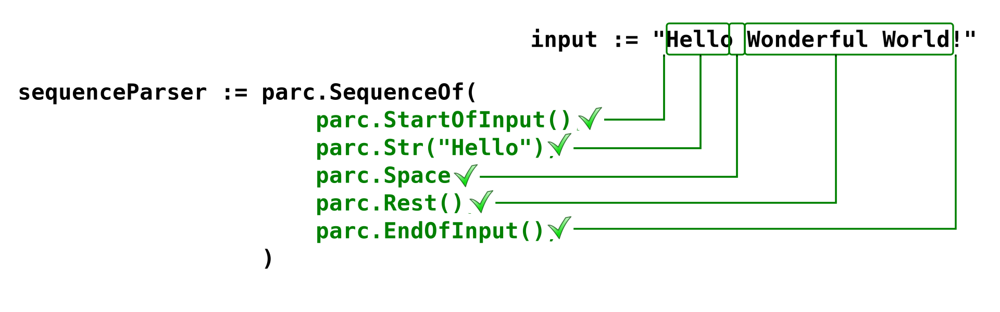

# Bevezetés a parc használatába

## Bevezetés

Üdvözöllek a parser kombinátorok (Parser Combinators) izgalmas világában!
Ez a megközelítés gyökeresen megváltoztathatja azt, ahogyan a nyelvi feldolgozásról, a fordítóprogramokról és a parszolásról gondolkodsz.

### Mi az a Parser Kombinátor?

A Parser Kombinátor egy olyan tervezési minta a szoftverfejlesztésben,
ahol a parserek első osztályú függvények vagy objektumok.
Ahelyett, hogy egyetlen monolitikus kódot generálnánk a teljes nyelvtanhoz,
kis, atomi parsereket (pl. egy szám, egy vessző, vagy egy azonosító felismerése) írunk,
amelyeket aztán kombinátorok (magasabb rendű függvények) segítségével fűzünk össze komplex, funkcionális parserekké.

A kombinátorok a következők:

- __Szekvencia__ (`A majd B`): Például: Először felismer egy nyitó zárójelet, majd egy kifejezést.

- __Alternatíva__ (`A vagy B`): Például: Felismer egy azonosítót vagy egy numerikus literált.

- __Ismétlés__ (`0 vagy több A`): Például: Felismer nulla vagy több szóközt.

Ez a módszer lehetővé teszi, hogy a nyelvtanunkat közvetlenül és deklaratívan, a kódunkban fejezzük ki.

### A parser combinátorok helye a parserek palettáján

A parserek és fordítóprogramok spektrumán a parser kombinátorok a rekurzív leszálló parserek családjába tartoznak.

- Generált Parserek
  (pl. [Yacc](https://hu.wikipedia.org/wiki/Yacc)/[Bison](https://www.gnu.org/software/bison/), [ANTLR](https://www.antlr.org/)):
  Ezek a leggyorsabbak.

  Igényelnek egy külső nyelvtani definíciós fájlt (pl. [EBNF](https://en.wikipedia.org/wiki/Extended_Backus%E2%80%93Naur_form)),
  amit egy külső eszköz (generátor) fordít le optimalizált kóddá.
  Erősek a komplex, [LR(k)](https://en.wikipedia.org/wiki/LR_parser) nyelvek kezelésében.

- Kézzel Írt [Rekurzív Leszálló Parserek](https://en.wikipedia.org/wiki/Recursive_descent_parser): A parser kombinátorok közeli rokona.
  Itt a logikát kézzel írod meg if/else és függvényhívásokkal.

- [Parser Kombinátorok](https://en.wikipedia.org/wiki/Parser_combinator): A kézzel írt rekurzív leszálló parserek absztrakciója.
  Megőrzik a rugalmasságot, de a kombinátorok maguk végzik a feltételes logikát és a rekurziót.
  Nincs szükség külső generátorra, a teljes nyelvtan a gazdanyelv (pl. Go, Haskell) kódjában van.

### Előnyök és Hátrányok

#### Előnyök (Mikor használd?)

- Deklaratív Nyelvtan: A nyelvtan leírása rendkívül rövid, olvasható és közvetlenül tükrözi a nyelvi szabályokat.

- Moduláris és Komponálható: A kis parserek újrahasznosíthatók és könnyen tesztelhetők.
  Egy nyelvtani szabály megváltoztatása nem érinti a teljes rendszert.

- Könnyű Hibakeresés: Mivel nincs generált kód, a debugger közvetlenül a nyelvtani szabályok (kombinátorok) logikájában állítható meg.

- Gyors Fejlesztés: Kis/közepes projektek esetében a fejlesztési idő rendkívül rövid, mivel nincs szükség külön build lépésre.

A parser kombinátorok ideálisak:

- Konfigurációs nyelvek: Egyszerű YAML-szerű vagy DSL (Domain Specific Language) fájlok elemzéséhez.
- Protokollok: Egyedi kommunikációs protokollok parszolásához.
- Oktatás/Prototípusok: Nyelvek gyors prototípusának elkészítéséhez és a parszolás logikájának elsajátításához.

#### Hátrányok (Mikor ne használd?)

- Teljesítmény: Általában lassabbak, mint a generált parserek (pl. LALR(1) parserek),
  mivel több belső függvényhívást és rekurziót tartalmaznak.

- Bal-rekurzió Kezelés: Az egyszerű parser kombinátorok gyakran alapból nem tudják kezelni a közvetlen bal-rekurziót
  (pl. `Expr -> Expr + Term`), ami végtelen ciklust okoz.
  Speciális kombinátorokra van szükség ennek megoldására.

- Nagy Nyelvek: Nagyon nagy, komplex nyelvek (pl. C++) esetén a teljesítmény-különbség hátrányossá válhat.

Ne használd, ha:

- Pusztán sebességre van szükség, és a nyelvtan már stabil (pl. egy JSON, XML vagy SQL parszolásánál,
  ahol kész, optimalizált könyvtárak léteznek).
- A nyelvtan kifejezetten összetett és hatalmas (pl. egy C++ fordító front-endje).

## A parc parser combinator csomag

### The Parser Objektumok

A parc csomag egy sor parser objektumot bocsájt rendelkezésre, amelyek építőelemekként funkcionálnak, mint például:
`Str()`, `Count()`, `SequenceOf()`, `Choice()`, stb.

Ezek az építőelemek kombinálhatók egymással, abból a célból, hogy létrehozzanak egy olyan alkalmazást,
amely képes értelmezni egy bemeneti string tartalmát a parser objektumok kombinációjával definiált szintaktikai szabályok szerint.

Így a szintaktikai szabályok azzal vannak kódolva, hogy milyen építőelemeket használunk, és hogyan kombináljuk őket egymással.

Az egyedi építőelem-parserek, valamint azok kompozíciója mind rendelkeznek egy `Parse()` nevű metódussal,
amely megkapja az elemzés tárgyát képező bemeneti stringet, és előállítja az elemzés eredményeit.

Például a `parc.Str("Hello").Parse("Hello World!")` kifejezés esetében, a bemeneti string a `"Hello World!"`, és a `Str("Hello")` a parser,
aminek meghívjuk a `Parse()` metódusát. Ez a parser illeszkedni fog a bemeneti string első szavára,
a kezdetétől az első szóköz karakterig, ami pontosan a `"Hello"` szó.

Minden egyszerű, építőelem-parser egy specifikus szabályt alkalmaz, és a `Parse()` metódus hívása sikeres lesz, abban az esetben,
ha ez a szabály alkalmazható a bemenetre. Ellenkező esetben hibát eredményez, ha a szabályt nem lehetett alkalmazni.

Az elemzés a bemeneti string elején kezdődik, és végződhet a végén, vagy valahol a bemeneti string eleje és vége között.

### The Parser State

A `Parse()` metódus visszatérő értéke valójában egy [`ParserState`](../state.go) objektum,
ami a parser aktuális állapotát reprezentálja, és a következőképpen néz ki:

```go
// ParserState represents an actual state of a parser
type ParserState struct {
	inputString *string
	Results     Result
	Index       int
	Err         error
	IsError     bool
}
```

A `ParserState` objektum tartalmaz egy referenciát az eredeti input stringre,
egy index értéket arra a karakterre, ami a végrehajtást követően a sorok következő pozíció.
Az `Error`  property `nil` lehet, vagy pedig egy `error`, attól függően, hogy sikeres volt-e az utolsó művelet,
továbbá egy `IsError` nevű `bool` property-t is tartalmaz, ami akkor `true`, ha az `Error` értéke nem `nil`.

A `Results` property típusa `Result`, ami tulajdonképpen az `any` típus.
Bizonyos esetekben ez egyetlen értéket hordoz, de hordozhatja a`[]Result` array-t is, annak függvényében, hogy a parser milyen fajtájú.

Ahogyan az elemi parserek sikeresen végrehajtódnak az input stringen, az index úgy halad előre, mindaddig, amíg el nem éri a string végét.
Amennyiben a parser sikertelen, tehát nem tudja illeszteni az elvárt mintázatot, abban az esetben az index visszaáll arra a pozícióra,
ahol a sikertelen parser elem a kezdésekor állt.

A soron következő példa az `Str()` parser-t fogja végrehajtani input string-re.
Ez a parser egy paramétert vár, ami egy string literál, és ez fogja meghatározni, hogy betűről-betűre milyen egyezést vár el a végrehajtásakor.
A példában a kiinduló pozíció a `0` indexű karakter:

Futtassuk az [Str példát](Str/Str.go): `go run tutorial/Str/Str.go`:

```go
	input := "Hello World"
	resultState := parc.Str("Hello World").Parse(&input)
	fmt.Printf("\n%+v\n", resultState)

	// >> inputString: 'Hello World', Results: Hello World, Index: 11, Err: <nil>, IsError: false
```

Az eredmény a sikeresen illeszkedő string, az új (`Index: 11,`) pozíció pedig a string végére fog mutatni, és nem kapunk hibát sem.

Ha egy olyan mintát próbálunk az inputra illeszteni, ami nem egyező, akkor az `Error` egy hibát fog tartalmazni a végehajtást követően, 
a `Results` property értéke `nil` lesz, az `Index` property pedig  `0` marad:

```go
	resultState = parc.Str("Will not match").Parse(&input)
	fmt.Printf("\n%+v\n", resultState)
	// => inputString: 'Hello World', Results: <nil>, Index: 0, Err: Str: could not match 'Will not match' with 'Hello World', IsError: true
```

A parc package egy csomó, különféle parsert biztosít számunkra.
Ezeket a parsereket három kategóriába sorolhatjuk:

- _elemi_ parserek (primitives),
- _feltételes_ parserek (conditionals),
- _kombinátor_-ok (combinators).

## Primitívek

A primitív parserek a legelemibb, és legegyszerűbb építő elemek.

Olyan érték illesztését vizsgálják, amelyek egyetlen karakterből, vagy egy string literál értékből állnak.

A `Str(s string)` parser a paraméterként megadott string literal értékét próbálja illeszteni, betűről-betűre, pontosan egyszer.

A `Chr(s string)` egyetlen karaktert próbál illeszteni. A parameternek egyetlen karakter hosszúságú string-nek kell lennie.

Futtassuk [a Char példát](Char/Char.go): `go run tutorial/Char/Char.go`:

```go
	input := "Hello World"
	resultState := parc.Char("H").Parse(&input)
	fmt.Printf("\n%+v\n", resultState)
	// => inputString: 'Hello World', Results: H, Index: 1, Err: <nil>, IsError: false

	resultState = parc.Char("_").Parse(&input)
	fmt.Printf("\n%+v\n", resultState)
	// => inputString: 'Hello World', Results: <nil>, Index: 0, Err: Could not match '_' with 'Hello World', IsError: true
```

Minden parser objektum implementál egy `.As(label string)` member function-t, ami egy cimkét rendel hozzá a parserhez.
Ez a cimke segíti a fejlesztési, hibakeresési folyamatot, mert ez íródik ki a parser eredeti neve helyett, amennyiben használtuk cimke hozzáadására.

Létezik néhány, előre definiált, gyakran használatos `Char()` és `Str()` primitive parser.
Ezek publikusa változóként érhetőek egy a package-ből, és nem függvényként:

```go
// Newline matches a space character ` `
var Space = Char(" ").As("Space")

// Newline matches a newline character \n
var Newline = Char("\n").As("Newline")

// Tab matches a tab character \t
var Tab = Char("\t").As("Tab")

// Crlf recognizes the string \r\n
var Crlf = Str("\r\n").As("Crlf")
```

A `RegExp(regexpStr string)` parser egy reguláris kifejezést próbál illeszteni.
A paramétere egy string, ami a reguláris kifejezést tartalmazza, amit illeszteni akarunk.

Futtassuk [a RegExp példát](RegExp/RegExp.go): `go run tutorial/RegExp/RegExp.go`:

```go
	input := "Hello World"
	resultState := parc.RegExp("^[A-Za-z]{5} [A-Za-z]{5}$").As("HelloWorld").Parse(&input)
	fmt.Printf("\n%+v\n", resultState)

	// => inputString: 'Hello World', Results: Hello World, Index: 11, Err: <nil>, IsError: false
```

A soron következő két primitív parser azt a célt szolgálja, hogy szigorúan elvárjuk, a parsolás elejét és végét,
tehát olyan parser-eket tudunk a segítségükkel írni, amelyeknek a tejles input stringet le kell fedniük, az elejétől a végéig.

- A `StartOfInput()` parser csak akkor lesz sikeres, ha a parser az input string legelső karakterén áll.
- A `EndOfInput()` végrehajtása csak akkor lesz sikeres, ha már nincs több karakter az input végén, vagyis az index az utolsó utáni helyre mutat.

A `Rest()` parser bármire egyezést mutat amit talál az aktuális pozíció és az input vége között.

A [`SequenceOf()` parser](https://github.com/tombenke/parc/tree/master/tutorial#sequenceof)
esetében láthatunk ezen primitívek alkalmazására példát.

## Feltételes parser-ek

A feltételes parserek egy logikai függvényt várnak, ami egy rune értékkel szembeni logikai feltételt határoz meg. 
A feltételes parser az input string soron következő rune-jával hívja ezt a függvényt,
ami vizsgálja a logikai feltétel teljesülését, és egy bool értékkel tér vissza.
Ha a rune kielégíti a logikai feltételt, akkor a függvény visszatérő értéke `true` lesz, ellenkező esetben pedig `false`.

Az alábbi példa egy ilyen feltétel vizsgáló függvényt mutat be, ami azt vizsgálja, hogy egy rune azonos-e
az ASCII space karakter, az újsor (newline) karakter, vagy a tab karakter valamelyikével.

```go
func IsWhitespace(r rune) bool {
	return r == ' ' || r == '\n' || r == '\t'
}
```

A parc package néhány hasznos, gyakran használatos feltételes függvényt definiál, úgymint:

- `IsAlphabetic (alias IsAsciiLetter)`,
- `IsDigit (alias IsDecimalDigit)`,
- `IsHexadecimalDigit`,
- `IsOctalDigit`,
- `IsBinaryDigit`,
- `IsAlphaNumeric`,
- `IsWhitespace`,
- `IsSpace`,
- `IsTab`,
- `IsNewline`,
- `IsCarriageReturn`,
- `IsAnyChar`.

Többfajta feltételes parser létezik, attól függően, hogy hány rune-át akarunk egyetlen lépésben illeszteni a logikai függvény segítségével:

- `Cond(conditionFn func(rune) bool)`: egyetlen rune-át elemez;
- `CondMin(conditionFn func(rune) bool, minOccurences int)` legkevesebb `minOccurences` számú rune-át illeszt;
- `CondMinMax(conditionFn func(rune) bool, minOccurences, maxOccurences int)`
  ez a parser legkevesebb `minOccurences` számú rune-át vár, de legfeljebb `maxOccurences` számút fog illeszteni.

Futtassuk [a Cond példát](Cond/Cond.go) ami egyetlen ASCII letter karaktert vár: `go run tutorial/Cond/Cond.go`

```go
	input := "Hello World"
	resultState := parc.Cond(parc.IsAsciiLetter).Parse(&input)

	fmt.Printf("%+v\n", resultState)
    
	// => inputString: 'Hello World', Results: H, Index: 1, Err: <nil>, IsError: false
```

Futtassuk [a CondMin példát](CondMin/CondMin.go): `go run tutorial/CondMin/CondMin.go`:

```go
	input := "Hello World"

	// Try to match at least 1 ASCII letter at the beginning of the input string
	resultState := parc.CondMin(parc.IsAsciiLetter, 1).Parse(&input)

	fmt.Printf("%+v\n", resultState)

	// => inputString: 'Hello World', Results: Hello, Index: 5, Err: <nil>, IsError: false

	// Try to match at least 8 ASCII letters at the beginning of the input string,
	// which will fail because there is a space at the 5th position
	resultState = parc.CondMin(parc.IsAsciiLetter, 8).Parse(&input)

	fmt.Printf("%+v\n", resultState)

	// => inputString: inputString: 'Hello World', Results: <nil>, Index: 0, Err: CondMin: 5 number of found are less then minOccurences: 8, IsError: true
```

Az első esetben legalább 1 ASCII letter karaktert próbál illeszteni, sikeresen, mert a `Hello` karakterei kielégítik a feltételt, és az illesztés befejeződik az első szóköz, karakternél.

A második esetben 8 ASCII letter karaktert várunk, ami nem tud teljesülni, mert az első szóközig mindössze 5 ilyen karakter található, ezért itt hibát kapunk eredményül.


Futtassuk [a CondMinMax példát](CondMin/CondMinMax.go) ami minimum egy, de legfeljebb 10 ASCII letter karaktert próbál illeszteni, sikeresen:
`go run tutorial/CondMinMax/CondMinMax.go`:


```go
	input := "Hello World"

	// Try to match at least 1 but at most 10 ASCII letters at the beginning of the input string
	resultState := parc.CondMinMax(parc.IsAsciiLetter, 1, 10).Parse(&input)

	fmt.Printf("%+v\n", resultState)

	// => inputString: 'Hello World', Results: Hello, Index: 5, Err: <nil>, IsError: false
```

## Kombinátorok

A kombinátorok magasabb rendű parserek létrehozását teszik lehetővé.
Ilyen magasabb rendű parsereket elemi parserekből, és más, magasabb rendű parserek _"kombinálásával"_ tudunk építeni.

Ez az alfejezet azokat a beépített parsereket ismerteti, amivel egyre bonyolultabb parser struktúrákat tudunk felépíteni.

### SequenceOf

A `SequenceOf(parsers ...*Parser)` parserek sorozatát hajtja végre egyenként, balról jobbra haladva, a definiálás sorrendjében, egy parser state-en.
Az így definiált kompozit parser akkor lesz sikeres, ha a benne felsorolt összes parser sikeresen végre tud hajtódni.

Futtassuk [a SequenceOf példát](SequenceOf/SequenceOf.go): `go run tutorial/SequenceOf/SequenceOf.go`:

```go
	input := "Hello Wonderful World!"
	sequenceParser := parc.SequenceOf(

		parc.StartOfInput(),
		parc.Str("Hello"),
		parc.Space,
		parc.Rest(),
		parc.EndOfInput(),
	)
	resultState := sequenceParser.Parse(&input)
	fmt.Printf("%+v\n", resultState)
	// => inputString: 'Hello Wonderful World!', Results: [<nil> Hello   Wonderful World! Wonderful World!], Index: 22, Err: <nil>, IsError: false
```



### Choice

A `Choice(parsers ...*Parser)` parser számára megadható a parserek egy sorozata, amelyek egymás alternatívái lehetnek az illesztés során.
Amikor a kombinált parsert futtatjuk, akkor az egyes alternatívák, a definiálás sorrendjében megpróbálnak illeszkedni az inputra,
és az első sikeresen illeszkedő alternatíva fogja visszaadni az eredményt.
Ha egyik sem tud illeszkedni, akkor hibát kapunk eredményül.


```go
	parc.Debug(0)

	inputWithText := "Hello World"
	inputWithNumbers := "1342 234 45"

	// The choice parser takes either letters or digits
	choiceParser := parc.Choice(
		parc.Letters.As("letters"),
		parc.Digits.As("Digits"),
	).As("letters-or-digits")

	// The parser can parse the input string if it begins with letters
	resultState := choiceParser.Parse(&inputWithText)
	fmt.Printf("%+v\n", resultState)

	// => inputString: 'Hello World', Results: Hello, Index: 5, Err: <nil>, IsError: false

	// The parser also can parse the input string if it begins with digits
	resultState = choiceParser.Parse(&inputWithNumbers)
	fmt.Printf("%+v\n", resultState)

	// => inputString: '1342 234 45', Results: 1342, Index: 4, Err: <nil>, IsError: false
```

Az alábbi ábrán láthatjuk a fenti `Choice()` parser kód működését, a kétféle input esetében:


### Count

Ebben az alfejezetben azokat a kombinátorokat ismertetjük, amelyek képesek a beágyazott parsereket meghatározott alkalommal, ismétlődően illeszteni.
Ezeknek a parsereknek a változatai mint a `Count...()` előtaggal kezdődnek.

A `Count(parser *Parser, count int)` (alias `Times()`):
megpróbálja az első paraméterként megadott parsert, a második paraméterként megadott számban, ismétlődően illeszteni az inputra.
Az eredményeket egy array-ben fogjuk megkapni, sikeres illesztés esetén.
Ha nem sikerült az elvárt számban, ismétlődően illeszteni a parsert, akkor hibát kapunk eredményül.
A `Count()` helyett a `Times()` nevű kombinátort is használhatjuk. Ezek egymás alias-ai.

Futtassuk [a Count példát](Count/Count.go): `go run tutorial/Count/Count.go`:

```go
	input := "Hello Hello Hello Hello Hello "

	resultState := parc.Count(parc.Str("Hello "), 4).Parse(&input)
	fmt.Printf("%+v\n", resultState)

	// => inputString: 'Hello Hello Hello Hello Hello ', Results: [Hello  Hello  Hello  Hello ], Index: 24, Err: <nil>, IsError: false

	resultState = parc.Count(parc.Str("XXX "), 4).Parse(&input)
	fmt.Printf("%+v\n", resultState)

	// => inputString: 'Hello Hello Hello Hello Hello ', Results: <nil>, Index: 0, Err: <nil>, IsError: true
```

A `CountMin(parser *Parser, minOccurences int)` (alias `TimesMin()`):
Az első paraméterként megadott parsert próbálja illeszteni legalább annyiszor,
mint amit a második paraméterben meghatározott `minOccurences` érték definiál.
Az eredményeket egy array-be gyűjti. Ha nem sikerül az illesztést az elvárt minimális számban végrehajtani, akkor hibával tér vissza.

Alias-ként a `TimesMin()` megnevezést is használhatjuk a `CountMin()` helyett.

Futtassuk [a CountMin példát](CountMin/CountMin.go): `go run tutorial/CountMin/CountMin.go`:

```go
	input := "Hello Hello Hello Hello "

	resultState := parc.CountMin(parc.Str("Hello "), 2).Parse(&input)
	fmt.Printf("%+v\n", resultState)

	// => inputString: 'Hello Hello Hello Hello ', Results: [Hello  Hello  Hello  Hello ], Index: 24, Err: <nil>, IsError: false
```

A `CountMinMax(parser *Parser, minOccurences int, maxOccurences int)` (alias `TimesMinMax()`):
megpróbálja az első paraméterként megadott parsert annyiszor végrehajtani, ismételten, ahányszor azt a `minOccurences` és `maxOccurences` tartomány meghatároz.
Az eredményeket egy array-ben gyűjti össze.
Ha nem sikerül legalább `minOccurences` alkalommal illesztenie a parsert, akkor hibával tér vissza.

A `TimesMinMax()` elnevezést is használhatjuk a `CountMinMax()` helyett.

Futtassuk [a CountMinMax példát](CountMinMax/CountMinMax.go): `go run tutorial/CountMinMax/CountMinMax.go`:

```go
	input := "Hello Hello Hello Hello Hello "

	resultState := parc.CountMinMax(parc.Str("Hello "), 1, 3).Parse(&input)
	fmt.Printf("%+v\n", resultState)

	// => inputString: 'Hello Hello Hello Hello Hello ', Results: [Hello  Hello  Hello ], Index: 18, Err: <nil>, IsError: false

	resultState = parc.CountMinMax(parc.Str("Hello "), 1, 24).Parse(&input)
	fmt.Printf("%+v\n", resultState)

	// => inputString: 'Hello Hello Hello Hello Hello ', Results: [Hello  Hello  Hello  Hello  Hello ], Index: 30, Err: <nil>, IsError: false
```

Az alábbi ábra azt szemléltei, hogy miként működik a `CountMinMax()` kombinátor, különböző paraméterezéssel:


Az alábbiakban felsorolt parserek rövidített nevű aliasként használhatóak a gyakran alkalmazott `Count...()` parser variánsokra.

- `ZeroOrOne(parser *Parser)` (alias `Optional`):
  A paraméterként megadott parsert próbálja illeszteni legfeljebb egyszer.
  Ha nem tudja egyszer sem illeszteni, akkor `nil` értékkel tér vissza. Ha sikerül illeszteni, akkor a sikeres illesztés eredménye lesz a visszatérő érték.
  Soha nem ad vissza `error` értéket, akkor sem ha egyszer sem sikerült illesztenie a paraméterként megadott parsert.
  A következőképpen is definiálható: `CountMinMax(parser, 0, 1)`.

- `ZeroOrMore(parser *Parser)`:
  A paraméterként megadott parsert próbálja illeszteni annyiszor, ahányszor csak lehetséges.
  Az eredményeket egy array-ben gyűjti össze.
  Soha nem ad vissza `error` értéket, akkor sem ha egyszer sem sikerült illesztenie a paraméterként megadott parsert.
  A következőképpen is definiálható: `CountMin(parser, 0)`.

- `OneOrMore(parser *Parser)`:
  Hasonló a `ZeroOrMore()` parserhez,
  de ennek legalább egy alkalommal sikeresen kell illesztenie a parser-t, ezen felül annyiszor illeszti, ahányszor az lehetséges.
  Az eredményeket egy array-ben gyűjti össze.
  Ha egyszer sem sikerül illeszkedést detektálnia, abban az esetben hibával tér vissza.
  A következőképpen is definiálható: `CountMin(parser, 1)`.


## Mapping

Minden parser objektum implementálja a `Map()` metódust, ami paraméterként egy mapper függvényt kap.
A parser, a sikeres illesztést követően meghívja a `Map()` metódus számára definiált mapper függvényt, paraméterként átadva annak a parser eredményét.
A mapper függvény feldolgozza és átalakíthatja ezt az eredmény, és amit visszaad, az lesz majd a parser végső eredménye.
A `Map()` metódus tehát kulcs szerepet játszik abban, hogy a nyers eredményeket, amelyek lényegében az input string részei,
átalakítsa olyan formára, ami a későbbi feldolgozás számára hasznosabb.
Jellemzően ezzel a művelettel lehet összerakni egy absztrakt szintaxis fa (AST) csomópontjait,
amit azután át lehet adni egy további feldolgozó rutinnak,
pl.: kiíratni az eredetitől eltérő reprezentációs formátumban (JSON, YAML),
de programok esetében közvetlenül végre is lehet hajtani (interpreter), vagy futtatható kódot lehet generálni belőle (compiler).

Az alábbi kódrészletben az `Integer` parser egy vagy több számjegy karaktert illeszt az input stringben, majd a végén, az átalakítást követően egy `int` típusú értékkel tér vissza.
A típus konverziót a parser `Map()` metódusa számára definiált mapper függvény végzi:

Futtassuk [a Map példát](Map/Map.go): `go run tutorial/Map/Map.go`:

```go
	integerMapperFn := func(in parc.Result) parc.Result {
		strValue := in.(string)
		intValue, _ := strconv.Atoi(strValue)
		return parc.Result(intValue)
	}

	Integer := parc.Digits.Map(integerMapperFn)

	input := "42"
	resultState := Integer.Parse(&input)
	fmt.Printf("\n%+v\n", resultState)

	// => inputString: '42', Results: 42, Index: 2, Err: <nil>, IsError: false
```

## Láncolás

A parszolási folyamat során egy adott szakaszban előfordulhat, hogy szükségessé válik annak megváltoztatása,
ahogyan a bemeneti string következő szakaszának elemzését folytatjuk.
Más szóval, meg kell változtatnunk azt a specifikus parsert, amivel folytatni akarjuk az elemzést.

Ennek a változásnak a hatóköre érvényes lehet a bemeneti string végéig, vagy csak a bemeneti string egy meghatározott részére.

A `Chain(parser *Parser, parserMakerFn func(Result) *Parser)` metódus teszi lehetővé,
hogy megváltoztassuk a parsert az elemzési folyamat folytatásához, a megelőző parser eredményétől függően.

Ez a parser egy olyan függvényt vár, amely paraméterként megkapja az utoljára illesztett értéket, és egy parsert kell, hogy visszaadjon.
Ezt a visszaadott parsert használja fel ezután a következő bemenet elemzésére, parser-láncot alkotva a korábbi bemenet alapján.

A láncolás (chaining) a kontextuális parserek létrehozásának alapvető módja.

Futtassuk [a Chain példát](Chain/Chain.go): `go run tutorial/Chain/Chain.go`:

```go
	// There are several format of inputs,
	// and the first segment before the `:` character
	// determines how to parse the rest of the input string.
	stringInput := "string:Hello"
	numberInput := "number:42"
	dicerollInput := "diceroll:2d8"

	// These are the parsers for the second part of the input string after the `:` character.

	// It parses a string value
	stringParser := parc.Letters

	// it parses a number value
	numberParser := parc.Digits

	// It parses a special format of dice-roll value
	dicerollParser := parc.SequenceOf(
		parc.Integer,
		parc.Char("d"),
		parc.Integer,
	)

	// This is the parser for the first part of the input string including the `:` separator character
	prefixParser := parc.SequenceOf(parc.Letters, parc.Char(":"))

	// This is the main parser, that chains the result of the prefix parser,
	// and the chain function selects that which parser should it use for the rest of the input string.
	parser := parc.Chain(
		prefixParser,
		func(result parc.Result) *parc.Parser {
			arr := result.([]parc.Result)
			leftValue := arr[0].(string)
			switch leftValue {
			case "string":
				return stringParser
			case "number":
				return numberParser
			default:
				return dicerollParser
			}
		})

	// Parse string input
	resultState := parser.Parse(&stringInput)
	fmt.Printf("%+v\n", resultState)

	// => inputString: 'string:Hello', Results: inputString: 'string:Hello', Results: Hello, Index: 12, Err: <nil>, IsError: false, Index: 7, Err: <nil>, IsError: false

	// Parse number input
	resultState = parser.Parse(&numberInput)
	fmt.Printf("%+v\n", resultState)

	// => inputString: 'number:42', Results: inputString: 'number:42', Results: 42, Index: 9, Err: <nil>, IsError: false, Index: 7, Err: <nil>, IsError: false

	// Parse diceroll input
	resultState = parser.Parse(&dicerollInput)
	fmt.Printf("%+v\n", resultState)

	// => inputString: 'diceroll:2d8', Results: inputString: 'diceroll:2d8', Results: [2 d 8], Index: 12, Err: <nil>, IsError: false, Index: 9, Err: <nil>, IsError: false
```

Az alábbi ábra azt az esetet szemlélteti, amikor az input string `"diceroll:2d8"`, és a `dicerollParser()`-t aktiválja a `Chain()`.


## Hibakeresés

Magasabb rendű, komplex parserek esetén nem triviális a hibák azonosítása,
ezért a parc csomag tartalmaz egy beépített hibakeresési (debugging) funkciót.

A parser képes hibakeresési információt kiírni a parszolás során, több részletességi szinten,
amelyek a `parc.Debug(level int)` függvénnyel szabályozhatók.

Minél magasabb a szint, annál részletesebb információ kerül kiírásra.
A `level=0` azt jelenti: _nem történik hibakeresési kiírás_.

Íme néhány példa a különböző hibakeresési szintekre, amelyek [a Choice parser példa](tutorial/Choice/Choice.go) futtatásakor kiíródnak:


```bash
go run tutorial/Choice/Choice.go
```

with `parc.Debug(1)`:

```txt
+-> letters-or-digits <= Input: 'Hello World'
|   +-> letters <= Input: 'Hello World'
|   +<- letters =>
|       Err: <nil>
+<- letters-or-digits =>
    Err: <nil>
inputString: 'Hello World', Results: Hello, Index: 5, Err: <nil>, IsError: false
+-> letters-or-digits <= Input: '1342 234 45'
|   +-> letters <= Input: '1342 234 45'
|   +<- letters =>
|       Err: letters: 0 number of found are less then minOccurences: 1 at index 0
|   +-> Digits <= Input: '1342 234 45'
|   +<- Digits =>
|       Err: <nil>
+<- letters-or-digits =>
    Err: <nil>
inputString: '1342 234 45', Results: 1342, Index: 4, Err: <nil>, IsError: false
```

with `parc.Debug(2)`:

```txt
+-> letters-or-digits <= Input: 'Hello World'
|   +-> letters <= Input: 'Hello World'
|   +<- letters =>
|       Err: <nil>, Result: 'Hello'
+<- letters-or-digits =>
    Err: <nil>, Result: 'Hello'
inputString: 'Hello World', Results: Hello, Index: 5, Err: <nil>, IsError: false
+-> letters-or-digits <= Input: '1342 234 45'
|   +-> letters <= Input: '1342 234 45'

ERROR: letters: 0 number of found are less then minOccurences: 1 at index 0
|   +<- letters =>
|       Err: letters: 0 number of found are less then minOccurences: 1 at index 0, Result: '<nil>'
|   +-> Digits <= Input: '1342 234 45'
|   +<- Digits =>
|       Err: <nil>, Result: '1342'
+<- letters-or-digits =>
    Err: <nil>, Result: '1342'
inputString: '1342 234 45', Results: 1342, Index: 4, Err: <nil>, IsError: false
```

with `parc.Debug(3)`:

```txt
+-> letters-or-digits <= Input: 'Hello World'
|   +-> letters <= Input: 'Hello World'
|   |    state.Consume(1) Index: '0'
|   |    state.Consume(1) Index: '1'
|   |    state.Consume(1) Index: '2'
|   |    state.Consume(1) Index: '3'
|   |    state.Consume(1) Index: '4'
|   |    state.Consume(1) Index: '5'
|   +<- letters =>
|       Err: <nil>, Result: 'Hello'
+<- letters-or-digits =>
    Err: <nil>, Result: 'Hello'
inputString: 'Hello World', Results: Hello, Index: 5, Err: <nil>, IsError: false
+-> letters-or-digits <= Input: '1342 234 45'
|   +-> letters <= Input: '1342 234 45'
|   |    state.Consume(1) Index: '0'

ERROR: letters: 0 number of found are less then minOccurences: 1 at index 0
|   +<- letters =>
|       Err: letters: 0 number of found are less then minOccurences: 1 at index 0, Result: '<nil>'
|   +-> Digits <= Input: '1342 234 45'
|   |    state.Consume(1) Index: '0'
|   |    state.Consume(1) Index: '1'
|   |    state.Consume(1) Index: '2'
|   |    state.Consume(1) Index: '3'
|   |    state.Consume(1) Index: '4'
|   +<- Digits =>
|       Err: <nil>, Result: '1342'
+<- letters-or-digits =>
    Err: <nil>, Result: '1342'
inputString: '1342 234 45', Results: 1342, Index: 4, Err: <nil>, IsError: false
```
