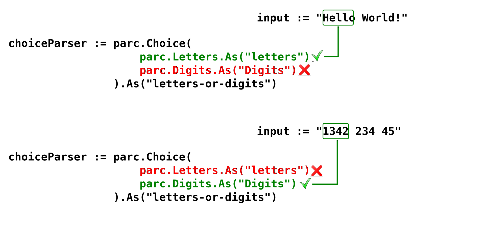
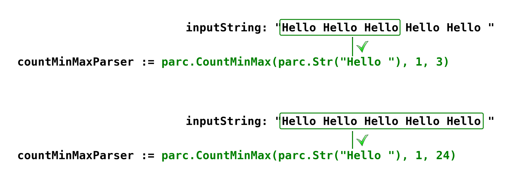
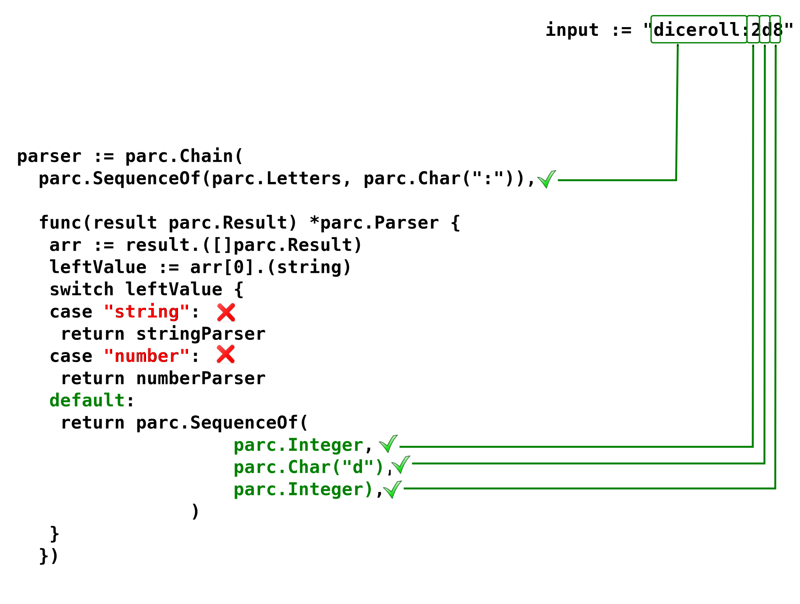

# parc tutorial

## Introduction

Welcome to the exciting world of Parser Combinators!
This approach can radically change how you think about language processing, compilers, and parsing in general.

### What is a Parser Combinator?

A Parser Combinator is a design pattern in software development where parsers are treated as first-class functions or objects.
Instead of generating a single, monolithic piece of code for the entire grammar, we write small, atomic parsers
(e.g., recognizing a number, a comma, or an identifier).
These small parsers are then composed into complex, functional parsers using combinators (higher-order functions).

The combinators typically implement fundamental language structures like:

- __Sequence__ (`A then B`): For example: Recognize an opening parenthesis, followed by an expression.

- __Alternative__ (`A or B`): For example: Recognize an identifier or a numeric literal.

- __Repetition__ (`0 or more A`): For example: Recognize zero or more spaces.

This method allows us to express our grammar directly and declaratively within our code.

### The Placement of parser combinators on the parser spectrum

On the spectrum of parsers and compilers, parser combinators belong to the family of recursive descent parsers.

- Generated Parsers
  (e.g., [Yacc](https://hu.wikipedia.org/wiki/Yacc)/[Bison](https://www.gnu.org/software/bison/), [ANTLR](https://www.antlr.org/)):
  These are the fastest.

  They require an external grammar definition file (e.g., [EBNF](https://en.wikipedia.org/wiki/Extended_Backus%E2%80%93Naur_form)),
  which an external tool (generator) compiles into optimized code.
  They are strong at handling complex, [LR(k)](https://en.wikipedia.org/wiki/LR_parser) languages.

- Hand-Written [Recursive Descent Parsers](https://en.wikipedia.org/wiki/Recursive_descent_parser): The close relative of parser combinators.
  Here, you write the logic by hand using if/else statements and function calls.

- [Parser Combinators](https://en.wikipedia.org/wiki/Parser_combinator): They are an abstraction of hand-written recursive descent parsers.
  They maintain flexibility, but the combinators themselves handle the conditional logic and recursion.
  No external generator is needed; the entire grammar resides in the host language's code (e.g., Go, Haskell).

### Advantages and Disadvantages

#### Advantages (When to Use Them)

- Declarative Grammar: The grammar definition is often very concise, highly readable, and directly mirrors the linguistic rules.

- Modular and Composable: Small parsers are reusable and easy to test.
  Changing one grammatical rule typically doesn't affect the entire system.

- Easy Debugging: Since there is no generated code, you can use your standard debugger
  to step directly through the logic of your grammatical rules (combinators).

- Fast Development: For small to medium projects, the development time is very short,
  as there's no separate build step required.

Parser combinators are ideal for:

- Configuration Languages: Parsing simple YAML-like or DSL (Domain Specific Language) files.
- Protocols: Parsing custom communication protocols.
- Education/Prototyping: Quickly building language prototypes and understanding the logic of parsing.

#### Disadvantages (When Not to Use Them)

- Performance: They are generally slower than generated parsers (like LALR(1) parsers)
  because they involve more internal function calls and recursion.

- Left-Recursion Handling: Simple parser combinators often cannot inherently handle immediate left-recursion
  (e.g., `Expr -> Expr + Term`), leading to infinite loops.
  Special, more complex combinators are required to solve this.

- Large Languages: The performance gap can become a significant drawback when parsing very large,
  complex languages (e.g., the front-end of a C++ compiler).

You should avoid them if:

- Raw speed is the absolute priority, and the grammar is already stable
  (e.g., parsing JSON, XML, or SQL, where highly optimized libraries already exist).
- The grammar is excessively complex and massive (e.g., the front-end of a C++ compiler).

## The parc parser combinator package

### The Parser Objects

The parc package provides a set of parser objects, that are building blocks, such as: `Str()`, `Count()`, `SequenceOf()`, `Choice()`, etc.
These building blocks can be combined to build up an application that is able to interpret the content of an
input string according to the syntactic rules that is defined via the combination of the parser objects.

So the syntactic rules are coded by which building blockes used, and how they are combined with each other.

The individual building block parsers as well as the composition of them will provide a method called `Parse()`
that receives the input string to parse, and produces the results of parsing.

In the following example: `parc.Str("Hello").Parse("Hello World!")`,
the input string is `"Hello World!"` and the `Str("Hello")` parser
will match the first word of the input string from the beginning until the first space character that is `"Hello"`.

Every simple, building block parser applies a specific rule, and the call of the `Parse()` method will be successful,
if this rule can be applied to the input, or the result will be an error in case the rule could not apply.

The parsing starts at the beginning of the input string and may end at the end
or somewhere in between the beginning and the end of the input string.

### The Parser State

In fact the return value of the `Parse()` method will be a [`ParserState`](../state.go):

```go
// ParserState represents an actual state of a parser
type ParserState struct {
	inputString *string
	Results     Result
	Index       int
	Err         error
	IsError     bool
}
```
The parser state holds a reference to the original input string,
the actual index of the character in the input string after the execution of the method,
the `Error` property that is either `nil` or an `error`,
and a helper `bool` property that is called `IsError` that will be `true` in case the `Error` is not `nil`.

The `Results` property has `Result` type, that is actually `any`.
In some cases it holds a single value, but it may also hold an `[]Result` array, depending on the type of parser used.

As the elementary parsers are successfully executed on the input string,
the index will be moved along it until it reaches the end of the string.
When a parser fails, the index will point to the same position that was before the last call.

The following example will apply the `Str()` parser to the input string.
This parser has a parameter, that is a literal string,
and it tries to match this string to the input string at the actual position, that is `0` at the moment:

Run the [Str example](Str/Str.go): `go run tutorial/Str/Str.go`:

```go
	input := "Hello World"
	resultState := parc.Str("Hello World").Parse(&input)
	fmt.Printf("\n%+v\n", resultState)

	// >> inputString: 'Hello World', Results: Hello World, Index: 11, Err: <nil>, IsError: false
```

The result will be the matched string, and the new (`Index: 11,`) position points to the end of the input string, and no errors occured.

If we try to apply a non-matching string the resulted state will hold an error,
the `Results` property will be `nil`, and the `Index` property remains `0`:

```go
	resultState = parc.Str("Will not match").Parse(&input)
	fmt.Printf("\n%+v\n", resultState)
	// => inputString: 'Hello World', Results: <nil>, Index: 0, Err: Str: could not match 'Will not match' with 'Hello World', IsError: true
```

The parc package provides a set of different parsers.
These parsers can be classified into three categories:

- primitives,
- conditionals,
- combinators.

## Primitives

The primitive parsers are the most basic building blocks.

They makes possible to match specific literal values,
that are single characters or strings.

The `Str(s string)` parser matches a fixed string literal value given as parameter, with the target string exactly one time.

The `Chr(s string)` matches a single character. The parameter must be a one-character-long string.

Run [the Char example](Char/Char.go): `go run tutorial/Char/Char.go`:

```go
	input := "Hello World"
	resultState := parc.Char("H").Parse(&input)
	fmt.Printf("\n%+v\n", resultState)
	// => inputString: 'Hello World', Results: H, Index: 1, Err: <nil>, IsError: false

	resultState = parc.Char("_").Parse(&input)
	fmt.Printf("\n%+v\n", resultState)
	// => inputString: 'Hello World', Results: <nil>, Index: 0, Err: Could not match '_' with 'Hello World', IsError: true
```

Every parser object has an `.As(label string)` member function, that assigns a label to it.
This label helps the debugging, because this will be printed out instead of the original, native name of the parser.

There are some predefined `Char()` and `Str()` primitive parsers that often used.
These exported as public variables, and not functions:

```go
// Newline matches a space character ` `
var Space = Char(" ").As("Space")

// Newline matches a newline character \n
var Newline = Char("\n").As("Newline")

// Tab matches a tab character \t
var Tab = Char("\t").As("Tab")

// Crlf recognizes the string \r\n
var Crlf = Str("\r\n").As("Crlf")
```

The `RegExp(regexpStr string)` parser tries to match a regular expression.
Its parameter is a string, that holds a regular expression to match.

Run [the RegExp example](RegExp/RegExp.go): `go run tutorial/RegExp/RegExp.go`:

```go
	input := "Hello World"
	resultState := parc.RegExp("^[A-Za-z]{5} [A-Za-z]{5}$").As("HelloWorld").Parse(&input)
	fmt.Printf("\n%+v\n", resultState)

	// => inputString: 'Hello World', Results: Hello World, Index: 11, Err: <nil>, IsError: false
```

The following two parsers are used to strictly define the beginning and the end of parsing,
and makes sure if the complete input string is fully processed:

- The `StartOfInput()` parser that only succeeds when the parser is at the beginning of the input.
- The `EndOfInput()` is a parser that only succeeds when there is no more input to be parsed.

The `Rest()` returns the remaining input.

See also the [`SequenceOf()` parser](https://github.com/tombenke/parc/tree/master/tutorial#sequenceof)
for the application of these last three parsers.

## Conditionals

The conditional parsers get a logic function that defines a criteria against a rune value.
This function matches the next single rune from the input string and returns with a boolean value.
This return value is `true` if the rune satisfies the criteria, otherwise it returns `false`.

This is an example for a condition function, that tests if rune is ASCII space, newline or tab

```go
func IsWhitespace(r rune) bool {
	return r == ' ' || r == '\n' || r == '\t'
}
```

The parc package defines a handful of frequently used condition function, such as:

- `IsAlphabetic (alias IsAsciiLetter)`,
- `IsDigit (alias IsDecimalDigit)`,
- `IsHexadecimalDigit`,
- `IsOctalDigit`,
- `IsBinaryDigit`,
- `IsAlphaNumeric`,
- `IsWhitespace`,
- `IsSpace`,
- `IsTab`,
- `IsNewline`,
- `IsCarriageReturn`,
- `IsAnyChar`.

There are several versions of the conditional parser, according to the number of runes we want to match in a single step:

- `Cond(conditionFn func(rune) bool)`: parses a single rune;
- `CondMin(conditionFn func(rune) bool, minOccurences int)` parses runes at least `minOccurences` number of runes;
- `CondMinMax(conditionFn func(rune) bool, minOccurences, maxOccurences int)`
  parses runes at least `minOccurences` number of runes but maximum `maxOccurences` number of runes.

Run [the Cond example](Cond/Cond.go): `go run tutorial/Cond/Cond.go`

```go
	input := "Hello World"
	resultState := parc.Cond(parc.IsAsciiLetter).Parse(&input)

	fmt.Printf("%+v\n", resultState)
    
	// => inputString: 'Hello World', Results: H, Index: 1, Err: <nil>, IsError: false
```

Run [the CondMin example](CondMin/CondMin.go): `go run tutorial/CondMin/CondMin.go`:

```go
	input := "Hello World"

	// Try to match at least 1 ASCII letter at the beginning of the input string
	resultState := parc.CondMin(parc.IsAsciiLetter, 1).Parse(&input)

	fmt.Printf("%+v\n", resultState)

	// => inputString: 'Hello World', Results: Hello, Index: 5, Err: <nil>, IsError: false

	// Try to match at least 8 ASCII letters at the beginning of the input string,
	// which will fail because there is a space at the 5th position
	resultState = parc.CondMin(parc.IsAsciiLetter, 8).Parse(&input)

	fmt.Printf("%+v\n", resultState)

	// => inputString: inputString: 'Hello World', Results: <nil>, Index: 0, Err: CondMin: 5 number of found are less then minOccurences: 8, IsError: true
```

Run [the CondMinMax example](CondMin/CondMinMax.go): `go run tutorial/CondMinMax/CondMinMax.go`:


```go
	input := "Hello World"

	// Try to match at least 1 but at most 10 ASCII letters at the beginning of the input string
	resultState := parc.CondMinMax(parc.IsAsciiLetter, 1, 10).Parse(&input)

	fmt.Printf("%+v\n", resultState)

	// => inputString: 'Hello World', Results: Hello, Index: 5, Err: <nil>, IsError: false
```

## Combinators

The combinators make possible to combine parsers to build up higher level of parsers.
The members of the combination can be primitive parser as well as complex parsers,
that are constructed out of other simple and/or complex parsers.

This section introduces those build-in parsers that helps to construct more and more complex parser structures.

### SequenceOf

The `SequenceOf(parsers ...*Parser)` executes a sequence of parsers against a parser state one-by-one, in the order of definition.
The composit parser will succeed if all the parsers could match against the input string.

Run [the SequenceOf example](SequenceOf/SequenceOf.go): `go run tutorial/SequenceOf/SequenceOf.go`:

```go
	input := "Hello Wonderful World!"
	sequenceParser := parc.SequenceOf(

		parc.StartOfInput(),
		parc.Str("Hello"),
		parc.Space,
		parc.Rest(),
		parc.EndOfInput(),
	)
	resultState := sequenceParser.Parse(&input)
	fmt.Printf("%+v\n", resultState)
	// => inputString: 'Hello Wonderful World!', Results: [<nil> Hello   Wonderful World! Wonderful World!], Index: 22, Err: <nil>, IsError: false
```


### Choice

The `Choice(parsers ...*Parser)` parser executes a sequence of parsers that alternatives relative to each other against a parser state.
When parse the input, it tries to match these alternative parsers in the order of their definition,
then returns the first successful result if there is any.

```go
	parc.Debug(0)

	inputWithText := "Hello World"
	inputWithNumbers := "1342 234 45"

	// The choice parser takes either letters or digits
	choiceParser := parc.Choice(
		parc.Letters.As("letters"),
		parc.Digits.As("Digits"),
	).As("letters-or-digits")

	// The parser can parse the input string if it begins with letters
	resultState := choiceParser.Parse(&inputWithText)
	fmt.Printf("%+v\n", resultState)

	// => inputString: 'Hello World', Results: Hello, Index: 5, Err: <nil>, IsError: false

	// The parser also can parse the input string if it begins with digits
	resultState = choiceParser.Parse(&inputWithNumbers)
	fmt.Printf("%+v\n", resultState)

	// => inputString: '1342 234 45', Results: 1342, Index: 4, Err: <nil>, IsError: false
```

The figure below shown how the same `Choice()` parser works with different inputs:




### Count

This section summarizes those parsers that makes possible to repeat a given parser to match several times continually.
The number of occurences can be defined within the variants of the `Count...()` parsers.

The `Count(parser *Parser, count int)` (alias `Times()`):
tries to execute the parser given as a parameter exactly count times.
Collects results into an array and returns with it at the end.
It returns error if it could not run the parser exaclty count times.
You can use Times parser, instead of Count since that is an alias of this parser.

Run [the Count example](Count/Count.go): `go run tutorial/Count/Count.go`:

```go
	input := "Hello Hello Hello Hello Hello "

	resultState := parc.Count(parc.Str("Hello "), 4).Parse(&input)
	fmt.Printf("%+v\n", resultState)

	// => inputString: 'Hello Hello Hello Hello Hello ', Results: [Hello  Hello  Hello  Hello ], Index: 24, Err: <nil>, IsError: false

	resultState = parc.Count(parc.Str("XXX "), 4).Parse(&input)
	fmt.Printf("%+v\n", resultState)

	// => inputString: 'Hello Hello Hello Hello Hello ', Results: <nil>, Index: 0, Err: <nil>, IsError: true
```

The `CountMin(parser *Parser, minOccurences int)` (alias `TimesMin()`):
tries to execute the parser given as a parameter at least `minOccurences` times.
Collects results into an array and returns with it at the end.
It returns error if it could not run the parser at least `minOccurences` times.
You can use `TimesMin()` parser, instead of `CountMin()` since that is an alias of this parser.

Run [the CountMin example](CountMin/CountMin.go): `go run tutorial/CountMin/CountMin.go`:

```go
	input := "Hello Hello Hello Hello "

	resultState := parc.CountMin(parc.Str("Hello "), 2).Parse(&input)
	fmt.Printf("%+v\n", resultState)

	// => inputString: 'Hello Hello Hello Hello ', Results: [Hello  Hello  Hello  Hello ], Index: 24, Err: <nil>, IsError: false
```

The `CountMinMax(parser *Parser, minOccurences int, maxOccurences int)` (alias `TimesMinMax()`):
tries to execute the parser given as a parameter at least `minOccurences` but maximum `maxOccurences` times.
Collects results into an array and returns with it at the end.
It returns error if it could not run the parser at least `minOccurences` times.
You can use `TimesMinMax()` parser, instead of `CountMinMax()` since that is an alias of this parser.

Run [the CountMinMax example](CountMinMax/CountMinMax.go): `go run tutorial/CountMinMax/CountMinMax.go`:

```go
	input := "Hello Hello Hello Hello Hello "

	resultState := parc.CountMinMax(parc.Str("Hello "), 1, 3).Parse(&input)
	fmt.Printf("%+v\n", resultState)

	// => inputString: 'Hello Hello Hello Hello Hello ', Results: [Hello  Hello  Hello ], Index: 18, Err: <nil>, IsError: false

	resultState = parc.CountMinMax(parc.Str("Hello "), 1, 24).Parse(&input)
	fmt.Printf("%+v\n", resultState)

	// => inputString: 'Hello Hello Hello Hello Hello ', Results: [Hello  Hello  Hello  Hello  Hello ], Index: 30, Err: <nil>, IsError: false
```

The next figure shows how the `CountMinMax()` combinator works with different parameters:




The following parsers can be taken as a shortcut of the `Count...()` counterparts.

- `ZeroOrOne(parser *Parser)` (alias `Optional`):
  tries to execute the parser given as a parameter once.
  It returns `nil` if it could not match, or a single result if match occured.
  It never returns error either it could run the parser only once or could not run it at all.
  This can be also defined as `CountMinMax(parser, 0, 1)`.

- `ZeroOrMore(parser *Parser)`:
  tries to execute the parser given as a parameter, until it succeeds.
  Collects the results into an array and returns with it at the end.
  It never returns error either it could run the parser any times without errors or never.
  This can be also defined as `CountMin(parser, 0)`.

- `OneOrMore(parser *Parser)`:
  is similar to the ZeroOrMore parser,
  but it must be able to run the parser successfuly at least once, otherwise it return with error.
  It executes the parser given as a parameter, until it succeeds,
  meanwhile it collects the results into an array then returns with it at the end.
  This can be also defined as `CountMin(parser, 1)`.

## Mapping

Every parser object implements a `Map()` method, that must get a mapper function. This mapper function gets the latest result of the `Parse()` call, and returns any value that is made out of the raw input result.

The Map() method therefore plays a key role in transforming the raw results -- which are essentially just fragments of the input string -- into a form that is more useful for subsequent processing.

Typically, this operation is used to assemble the nodes of an Abstract Syntax Tree (AST).
This AST can then be passed on to a further processing routine,
for example: to output the results in a different representational format than the original (such as JSON or YAML),
or, in the case of programs, to execute the code directly (interpreter) or to generate executable code from it (compiler).

In the following example the `Integer` parser matches one or more digit characters with the target string and returns with an `int` value.
The conversion of the result to an integer is done in the `Map()` function of the parser:

Run [the Map example](Map/Map.go): `go run tutorial/Map/Map.go`:

```go
	integerMapperFn := func(in parc.Result) parc.Result {
		strValue := in.(string)
		intValue, _ := strconv.Atoi(strValue)
		return parc.Result(intValue)
	}

	Integer := parc.Digits.Map(integerMapperFn)

	input := "42"
	resultState := Integer.Parse(&input)
	fmt.Printf("\n%+v\n", resultState)

	// => inputString: '42', Results: 42, Index: 2, Err: <nil>, IsError: false
```

## Chaining

During the parsing process, at a given stage there can be cases, when it is necessary to change how to continue the parsing for the next section of the input string. In other words, we need to change the specific parser that we want to continue with the parsing.
The scope of this change may valid until the end of the input string, or it may valid only for a specific part of the input string.

The `Chain(parser *Parser, parserMakerFn func(Result) *Parser)` makes possible to change the parser for the continuation of parsing process
depending on the result of a parser.

This parser takes a function which receieves the last matched value and should return a parser.
That parser is then used to parse the following input, forming a chain of parsers based on previous input.
Chain is the fundamental way of creating contextual parsers.

Run [the Chain example](Chain/Chain.go): `go run tutorial/Chain/Chain.go`:

```go
	// There are several format of inputs,
	// and the first segment before the `:` character
	// determines how to parse the rest of the input string.
	stringInput := "string:Hello"
	numberInput := "number:42"
	dicerollInput := "diceroll:2d8"

	// These are the parsers for the second part of the input string after the `:` character.

	// It parses a string value
	stringParser := parc.Letters

	// it parses a number value
	numberParser := parc.Digits

	// It parses a special format of dice-roll value
	dicerollParser := parc.SequenceOf(
		parc.Integer,
		parc.Char("d"),
		parc.Integer,
	)

	// This is the parser for the first part of the input string including the `:` separator character
	prefixParser := parc.SequenceOf(parc.Letters, parc.Char(":"))

	// This is the main parser, that chains the result of the prefix parser,
	// and the chain function selects that which parser should it use for the rest of the input string.
	parser := parc.Chain(
		prefixParser,
		func(result parc.Result) *parc.Parser {
			arr := result.([]parc.Result)
			leftValue := arr[0].(string)
			switch leftValue {
			case "string":
				return stringParser
			case "number":
				return numberParser
			default:
				return dicerollParser
			}
		})

	// Parse string input
	resultState := parser.Parse(&stringInput)
	fmt.Printf("%+v\n", resultState)

	// => inputString: 'string:Hello', Results: inputString: 'string:Hello', Results: Hello, Index: 12, Err: <nil>, IsError: false, Index: 7, Err: <nil>, IsError: false

	// Parse number input
	resultState = parser.Parse(&numberInput)
	fmt.Printf("%+v\n", resultState)

	// => inputString: 'number:42', Results: inputString: 'number:42', Results: 42, Index: 9, Err: <nil>, IsError: false, Index: 7, Err: <nil>, IsError: false

	// Parse diceroll input
	resultState = parser.Parse(&dicerollInput)
	fmt.Printf("%+v\n", resultState)

	// => inputString: 'diceroll:2d8', Results: inputString: 'diceroll:2d8', Results: [2 d 8], Index: 12, Err: <nil>, IsError: false, Index: 9, Err: <nil>, IsError: false
```

The figure below demonstrates the case, when the input string is `"diceroll:2d8"`, and the `Chain()` parser selects the `dicerollParser()`.




## Debugging

In case of higher order, complex parsers it is not trivial to identify the bugs, so there is a built-in debugging feature of the parc package.

The parser can print debug information during the parsing, at several levels of details, that can be controlled by the `parc.Debug(level int)` function.

The higher the level, the more detailed information will be printed out. `level=0` means: _no debug will be printed_.

Here are some examples of the different debug levels, that is printed out, running [the Choice parser example](tutorial/Choice/Choice.go):

```bash
go run tutorial/Choice/Choice.go
```

with `parc.Debug(1)`:

```txt
+-> letters-or-digits <= Input: 'Hello World'
|   +-> letters <= Input: 'Hello World'
|   +<- letters =>
|       Err: <nil>
+<- letters-or-digits =>
    Err: <nil>
inputString: 'Hello World', Results: Hello, Index: 5, Err: <nil>, IsError: false
+-> letters-or-digits <= Input: '1342 234 45'
|   +-> letters <= Input: '1342 234 45'
|   +<- letters =>
|       Err: letters: 0 number of found are less then minOccurences: 1 at index 0
|   +-> Digits <= Input: '1342 234 45'
|   +<- Digits =>
|       Err: <nil>
+<- letters-or-digits =>
    Err: <nil>
inputString: '1342 234 45', Results: 1342, Index: 4, Err: <nil>, IsError: false
```

with `parc.Debug(2)`:

```txt
+-> letters-or-digits <= Input: 'Hello World'
|   +-> letters <= Input: 'Hello World'
|   +<- letters =>
|       Err: <nil>, Result: 'Hello'
+<- letters-or-digits =>
    Err: <nil>, Result: 'Hello'
inputString: 'Hello World', Results: Hello, Index: 5, Err: <nil>, IsError: false
+-> letters-or-digits <= Input: '1342 234 45'
|   +-> letters <= Input: '1342 234 45'

ERROR: letters: 0 number of found are less then minOccurences: 1 at index 0
|   +<- letters =>
|       Err: letters: 0 number of found are less then minOccurences: 1 at index 0, Result: '<nil>'
|   +-> Digits <= Input: '1342 234 45'
|   +<- Digits =>
|       Err: <nil>, Result: '1342'
+<- letters-or-digits =>
    Err: <nil>, Result: '1342'
inputString: '1342 234 45', Results: 1342, Index: 4, Err: <nil>, IsError: false
```

with `parc.Debug(3)`:

```txt
+-> letters-or-digits <= Input: 'Hello World'
|   +-> letters <= Input: 'Hello World'
|   |    state.Consume(1) Index: '0'
|   |    state.Consume(1) Index: '1'
|   |    state.Consume(1) Index: '2'
|   |    state.Consume(1) Index: '3'
|   |    state.Consume(1) Index: '4'
|   |    state.Consume(1) Index: '5'
|   +<- letters =>
|       Err: <nil>, Result: 'Hello'
+<- letters-or-digits =>
    Err: <nil>, Result: 'Hello'
inputString: 'Hello World', Results: Hello, Index: 5, Err: <nil>, IsError: false
+-> letters-or-digits <= Input: '1342 234 45'
|   +-> letters <= Input: '1342 234 45'
|   |    state.Consume(1) Index: '0'

ERROR: letters: 0 number of found are less then minOccurences: 1 at index 0
|   +<- letters =>
|       Err: letters: 0 number of found are less then minOccurences: 1 at index 0, Result: '<nil>'
|   +-> Digits <= Input: '1342 234 45'
|   |    state.Consume(1) Index: '0'
|   |    state.Consume(1) Index: '1'
|   |    state.Consume(1) Index: '2'
|   |    state.Consume(1) Index: '3'
|   |    state.Consume(1) Index: '4'
|   +<- Digits =>
|       Err: <nil>, Result: '1342'
+<- letters-or-digits =>
    Err: <nil>, Result: '1342'
inputString: '1342 234 45', Results: 1342, Index: 4, Err: <nil>, IsError: false
```

## Testing

One of the advantages of using parser combinators is that they allow the parser to be well-structured,
enabling the construction of increasingly complex parsers starting from an elementary level.

Each individual parser can be used independently, and this also means they are ideal for unit testing.

When creating a more complex parser, it is advisable to use an incremental approach and thoroughly test every elementary
and higher-order "intermediate" parser.

The parc package provides a little support for this with the TestCase structure, which looks like this:

```go
// Generic TestCase struct to help writing test cases for sub-parsers
type TestCase struct {
	Input          string
	ExpectedResult Result
}
```

The [testing/](testing/) folder holds some simple example about how can we implement these test cases.

In the [testing/parsers.go](testing/parsers.go) file there are three simple parser implementation: `Number`, `IntNumber`, `RealNumber`.
Moreover this file contains the definition of structure named `ASTNode`, that the parser returns as a result, during the parsing.
The parsers apply their `Map()` method to create these results.

```go
type NumberValue float64

type ASTNode struct {
	Tag   string
	Value NumberValue
}
```

The parsers look like this:

```go
var (
	Number    = *parc.Choice(&RealNumber, &IntNumber)
	
	IntNumber = *parc.Map(parc.Integer, func(in parc.Result) parc.Result {
		node := ASTNode{
			Tag:   "INTEGER",
			Value: NumberValue(in.(int)),
		}
		return parc.Result(node)
	})

	RealNumber = *parc.Map(parc.RealNumber, func(in parc.Result) parc.Result {
		node := ASTNode{
			Tag:   "REAL",
			Value: NumberValue(in.(float64)),
		}
		return parc.Result(node)
	})
)
```

The [testing/parsers_test.go](testing/parsers_test.go) shows some simple example about hiw can we implement unit tests to the atomic level and higher order parsers.

The following code fragment shows the testing of the `IntNumber` parser:

```go
package testing

import (
	"github.com/stretchr/testify/require"
	"github.com/tombenke/parc"
	"testing"
)

func TestIntNumber(t *testing.T) {

	validTestCases := []parc.TestCase{
		parc.TestCase{
			Input:          "42",
			ExpectedResult: ASTNode{Tag: "INTEGER", Value: NumberValue(42)},
		},
		parc.TestCase{
			Input:          "12342",
			ExpectedResult: ASTNode{Tag: "INTEGER", Value: NumberValue(12342)},
		},
	}

	for _, tc := range validTestCases {
		newState := IntNumber.Parse(&tc.Input)
		require.Equal(t, tc.ExpectedResult, newState.Results.(ASTNode))
		require.False(t, newState.IsError)
	}

	invalidInputs := []string{"?23", "AB23", "A33"}
	for _, input := range invalidInputs {
		newState := IntNumber.Parse(&input)
		require.True(t, newState.IsError)
	}
}
```

Run the test cases with the following command:

```bash
go test -v tutorial/testing/*

=== RUN   TestIntNumber
--- PASS: TestIntNumber (0.00s)
=== RUN   TestRealNumber
--- PASS: TestRealNumber (0.00s)
=== RUN   TestNumber
--- PASS: TestNumber (0.00s)
PASS
ok  	command-line-arguments	0.002s
```

